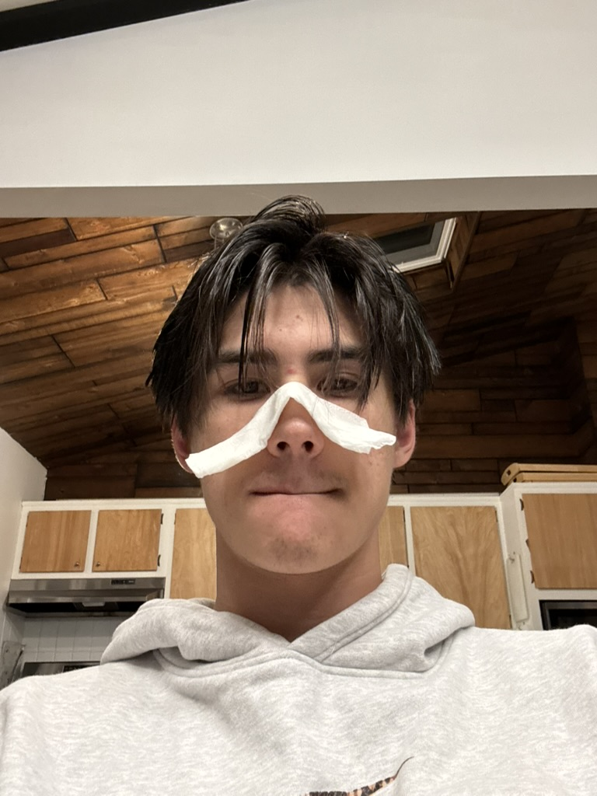

# Web-Server-Programming-In-Class-Project
Repo housing follow-along class work for my Spring 2026 Web Server Programming class

## Here's what I look like:

## My Computer Experience:
I am currently a Computer Science major and I’ve taken CS1,2,&3, Data Science, PPL, and Digital Logic so far. I’ve made a bunch of small programs before that mostly function in the command line, like tic tac toe, hangman, etc. For larger projects, I’ve created a climbing workout analyzer program that takes in my training excel spreadsheet, runs a pandas analysis script, and outputs graphs and metrics. I’ve also done a data science project where I coded a ML pipeline, ingesting dirty CSV data, cleaning and preprocessing it, training a model on it, and testing the model. For this project I wrote some of the code for each part of the process, but my groupmates also helped me fix anything that broke and contributed to each part as well. The only web related project I’ve done is a website similar to Kahoot that allows teachers to get classroom feedback by having their students join a classroom session that allows them to post questions and vote on polls in real time. For this project I focused on creating the API in the backend and managing persisting data, and my partner took care of the frontend code. 

## How I see myself using what I've learned in this course:
Creating this web-based project opened up a lot of doors for me, but it also showed me how little I understand about the web and building web applications. That’s why I’m excited to take this class and gain a strong foundation of how all of the bits and pieces work. Learning how to create a real full stack application allows me to create real tools and services with code. I think this is amazing. I’ve always had website and business ideas, and I would use what I’ve learned in this class as a foundation for understanding how everything works, so that I can continue learning how to make applications that bring these ideas to life and solve real problems. 